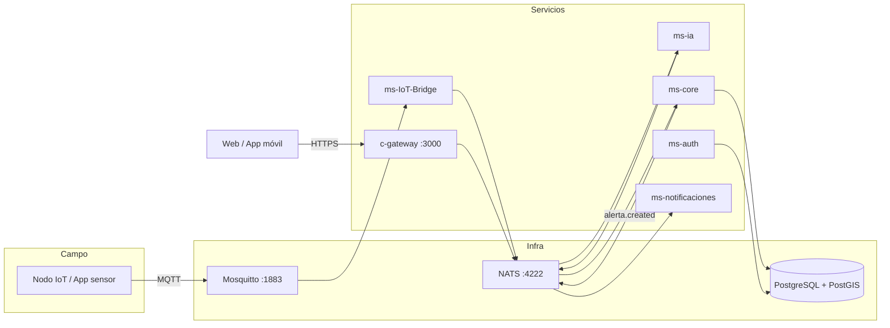

# Arquitectura del backend — CENTINELA

Monorepo `centinela-project`: microservicios dockerizados, mensajería NATS, persistencia PostgreSQL/PostGIS e integración IoT vía MQTT.

> Ver también: [ARQUITECTURA_FRONTEND.md](./ARQUITECTURA_FRONTEND.md) · [ARQUITECTURA.md](./ARQUITECTURA.md) · [contexto.md](./contexto.md)

---

## 1. Vista general



| Capa | Tecnología | Rol |
|------|------------|-----|
| **Gateway** | NestJS (`c-gateway`) | Única entrada HTTP/WebSocket |
| **Dominio** | NestJS (`ms-core`, `ms-auth`) | Lógica de negocio e identidad |
| **IoT / IA** | Python (`ms-IoT-Bridge`, `ms-ia`) | MQTT, clasificación YAMNet |
| **Notificaciones** | NestJS (`ms-notificaciones`) | Push, email, Telegram |
| **Mensajería** | NATS | Comunicación entre servicios |
| **Datos** | PostgreSQL + PostGIS | Esquemas `identity` y `app` |

---

## 2. Estructura del monorepo

```
centinela-project/
├── c-gateway/           # API Gateway (submódulo Git)
├── ms-auth/             # Autenticación y permisos
├── ms-core/             # Alertas, eventos, reportes, zonas, nodos
├── ms-notificaciones/   # Push, SMTP, Telegram
├── ms-ia/               # YAMNet (Python)
├── ms-IoT-Bridge/       # MQTT → NATS (Python)
├── docker-compose.yml   # Orquestación local
└── .env                 # Secretos (no commitear)
```

Cada carpeta es un **repositorio independiente** (Git submodule). El monorepo solo guarda el commit exacto de cada uno.

---

## 3. Microservicios

### `c-gateway` (NestJS) — puerto 3000

| Función | Detalle |
|---------|---------|
| REST `/api/*` | Proxy HTTP → NATS request/reply |
| WebSocket | Socket.IO en `/realtime` |
| Seguridad | JWT + permisos por endpoint |
| Medios | `POST /api/media/upload` → Cloudinary |

**Módulos:** `auth`, `alertas`, `reportes`, `zonas`, `nodos`, `eventos`, `media`, `realtime`.

---

### `ms-auth` (NestJS) — esquema `identity`

| Función | Detalle |
|---------|---------|
| Login / refresh token | Patrón NATS `login.user.auth` |
| Roles | `admin`, `operador`, `policia`, `ciudadano` |
| Permisos | Granulares (`alertas:update_status`, `usuarios:update`, etc.) |
| Email | Emite eventos NATS; envío real en `ms-notificaciones` |
| Usuarios | Alta, importación CSV/Excel, baja lógica |

---

### `ms-core` (NestJS) — esquema `app`

| Entidad | Uso |
|---------|-----|
| `zonas` | Polígonos PostGIS |
| `nodos` | IoT + heartbeat |
| `eventos` | Detecciones de audio (IA) |
| `reportes` | Incidentes ciudadanos |
| `alertas` | Ciclo: activa → reconocida → cerrada |

**Anti-falsos positivos** (`ConfirmacionAlertasService`):
- Confianza ≥ 0,85
- 2º nodo en misma zona en 30 s (o `ALERT_SINGLE_NODE_BYPASS=true` en pruebas)
- Emite `alerta.created` al crear alerta

**Patrones NATS ejemplo:** `alertas.findAll`, `reportes.create`, `eventos.create`, `zonas.findAll`.

---

### `ms-notificaciones` (NestJS)

| Evento NATS | Acción |
|-------------|--------|
| `alerta.created` | Push FCM (ciudadanos) + OneSignal (panel) |
| `email.send_*` | SMTP (verificación, reset password) |

Aislamiento: si falla el envío, `ms-core` ya persistió la alerta.

---

### `ms-IoT-Bridge` (Python)

- Suscribe MQTT `centinela/evento`
- Publica `eventos.create` en NATS
- Guarda audio en volumen compartido con `ms-ia`
- Actualiza heartbeats de nodos en BD

---

### `ms-ia` (Python)

- Lee audio WAV del volumen compartido
- Clasifica con YAMNet (`my_yamnet_classifier.h5`)
- Actualiza evento: subtipo, confianza
- Requiere modelo manual en `ms-ia/models/` antes del build

---

## 4. Comunicación

### HTTP → NATS (síncrono)

```
Cliente  →  POST /api/alertas/:id/reconocer
         →  c-gateway valida JWT + permisos
         →  NATS request: alertas.updateStatus
         →  ms-core procesa y responde
         →  JSON al cliente
```

### Eventos (asíncrono)

```
ms-core  →  emit('alerta.created', payload)
         →  ms-notificaciones (push/email)
         →  c-gateway/realtime (WebSocket al panel)
```

### IoT

```
Nodo  →  MQTT :1883  →  ms-IoT-Bridge  →  NATS  →  ms-ia + ms-core
```

**Convención:** siempre `NATS_SERVICE=nats://nats:4222`.

---

## 5. Base de datos

| Esquema | Servicio | Tablas principales |
|---------|----------|-------------------|
| `identity` | `ms-auth` | usuarios, roles, permisos, refresh_tokens |
| `app` | `ms-core` | zonas, nodos, eventos, reportes, alertas |

- **LOPDP:** `reportes.usuario_id` sin FK a identidad en flujos operativos
- **PostGIS:** `ST_Contains` para asignar `zona_id` por GPS
- **ORM:** Prisma 7 con adaptador `pg`
- **Host interno:** `postgres:5432` · **Host local:** `localhost:5433`

---

## 6. Puertos (desarrollo)

| Servicio | Puerto |
|----------|--------|
| `c-gateway` | 3000 |
| PostgreSQL | 5433 |
| NATS | 4222 / 8222 (monitor) |
| MQTT | 1883 |

---

## 7. Flujos backend

### Detección IoT + IA

```text
MQTT → ms-IoT-Bridge → eventos.create
     → ms-ia (YAMNet) → eventos.update
     → ms-core (multi-nodo) → alerta
     → alerta.created → ms-notificaciones + WebSocket
```

Severidad sugerida por `ms-ia`: disparo = 3, otro sonido de alerta (grito, etc.) = 2, normal = 1.

### Reporte ciudadano

```text
POST /api/reportes → ms-core
  → geometría + zona_id
  → alerta automática si tipo crítico
```

Prioridad/severidad por tipo (`reporte-tipos.ts`): pánico, homicidio/sicariato y secuestro = 4; robo y extorsión = 3; persona/vehículo sospechoso = 2. Detalle y justificación en [contexto.md](./contexto.md#severidad-y-prioridad-escala-1-5).

---

## 8. Seguridad

| Aspecto | Implementación |
|---------|----------------|
| Auth | JWT access + refresh (BD) |
| Autorización | Guards en gateway + permisos por rol |
| Medios | Cloudinary; máx. 5 MB; JPEG/PNG/WebP |
| Secretos | `.env`, Firebase JSON montado en notificaciones |

---

## 9. Despliegue

```bash
git clone --recurse-submodules https://github.com/Kaisitop/CentinelaProject.git
# Colocar ms-ia/models/my_yamnet_classifier.h5
# Configurar .env
docker compose up -d --build
```

**Healthchecks obligatorios:** NATS (`8222/healthz`) y PostgreSQL antes de arrancar servicios Nest/Python.

---

## 10. Decisiones clave

1. Microservicios + NATS (no monolito): paralelización y aislamiento de fallos.
2. Esquemas BD separados: cumplimiento LOPDP estructural.
3. Edge + MQTT: tolerancia a conectividad débil en Milagro.
4. Multi-nodo: mitigación de falsos positivos acústicos.
5. Git submódulos: versionado independiente por servicio.
6. Severidad: la confirmación humana (pánico ciudadano = 4) pesa más que la detección acústica probabilística (disparo IA = 3); la IA requiere confianza mínima o segundo nodo para generar alerta.

---

## 11. Prompt para diagrama de arquitectura (imagen)

Usa este prompt en **DALL·E, Midjourney, Ideogram, Canva AI** o en **diagramas** (Mermaid, draw.io, Lucidchart). Está adaptado al estilo de la referencia: caja **DOCKER NETWORK**, iconos planos azules, etiquetas amarillas de protocolo, líneas punteadas, flujo izquierda → derecha.

### Prompt principal (inglés — mejor resultado en generadores de imagen)

```text
Clean minimalist flat vector architecture diagram, white/light gray background, professional tech infographic style.

Large rounded rectangle container at the top labeled "DOCKER NETWORK — CENTINELA".

LEFT SIDE — CLIENTS (outside or on left edge of container):
- Web browser icon labeled "Panel Web (Next.js :3001)"
- Smartphone icon labeled "App Ciudadana (Flutter)"
- Small IoT device / Raspberry Pi icon labeled "Nodo IoT / Sensor"

CONNECTIONS FROM CLIENTS (yellow pill labels on dashed lines):
- Browser → dashed line labeled "REST + WebSocket" → API Gateway
- Smartphone → dashed line labeled "REST /api" → API Gateway
- IoT device → dashed line labeled "MQTT :1883" → MQTT Broker (Mosquitto icon)

CENTER — API GATEWAY:
- Blue circular icon with horizontal arrows, labeled "c-gateway (NestJS :3000)"

FROM API GATEWAY — fan-out dashed lines, each with yellow label "NATS :4222", connecting vertically to 5 microservices (blue cloud icons with gear inside):

1. "ms-auth" (JWT / Identity)
2. "ms-core" (Alertas, Reportes, Zonas)
3. "ms-notificaciones" (Push, Email, Telegram)
4. "ms-ia" (YAMNet Python)
5. "ms-IoT-Bridge" (MQTT → NATS Python)

Also: MQTT Broker connects with dashed line labeled "NATS" to ms-IoT-Bridge.

RIGHT SIDE — DATA LAYER:
- One PostgreSQL cylinder icon labeled "PostgreSQL + PostGIS :5433"
- Two smaller schema labels connected with dashed lines:
  - ms-auth → dashed "schema identity" → PostgreSQL
  - ms-core → dashed "schema app" → PostgreSQL
(ms-notificaciones, ms-ia, ms-IoT-Bridge have no own database — only NATS arrows)

BOTTOM or corner inside Docker box:
- Small NATS message broker icon labeled "NATS :4222"
- Small MQTT mosquito/broker icon labeled "Mosquitto :1883"

Style: simple blue (#2563EB) icons, yellow (#F59E0B) protocol tags, thin dashed gray connection lines, sans-serif font, no 3D, no photorealism, high contrast, landscape 16:9, suitable for academic thesis document.
```

### Prompt alternativo (español — Canva / Copilot)

```text
Diagrama de arquitectura de microservicios, estilo infográfico plano y minimalista, fondo blanco.

Contenedor grande arriba: "RED DOCKER — CENTINELA".

Izquierda: icono navegador "Panel Web Next.js", icono móvil "App Flutter", icono Raspberry "Nodo IoT".

Líneas punteadas con etiquetas amarillas:
- REST + WebSocket → API Gateway c-gateway puerto 3000
- REST → API Gateway
- MQTT 1883 → Mosquitto

Centro: API Gateway (círculo con flechas) conectado por NATS a 5 microservicios en columna (nubes azules con engranaje):
ms-auth, ms-core, ms-notificaciones, ms-ia, ms-IoT-Bridge.

Derecha: cilindro PostgreSQL + PostGIS; ms-auth conecta a esquema identity; ms-core a esquema app (misma base de datos, dos esquemas LOPDP).

Abajo dentro del contenedor: iconos NATS 4222 y Mosquitto 1883.

Colores: iconos azules, etiquetas de protocolo amarillas, líneas punteadas grises. Sin 3D. Formato horizontal para documento académico.
```

### Notas para que el diagrama sea fiel a CENTINELA

| Elemento | Cómo representarlo |
|----------|-------------------|
| **BD por servicio** | No hay 5 bases separadas. Usa **un solo PostgreSQL** con **dos esquemas** (`identity` → `ms-auth`, `app` → `ms-core`). |
| **Sin BD** | `ms-notificaciones`, `ms-ia` y `ms-IoT-Bridge` solo se conectan por **NATS** (y MQTT en el bridge). |
| **Clientes** | Panel web + app móvil van al **gateway**; el nodo IoT va a **MQTT**, no al gateway directamente. |
| **Tiempo real** | Opcional: línea punteada `WebSocket /realtime` del gateway al panel web. |

### Si usas draw.io / Lucidchart (más control)

Copia esta lista de cajas y conexiones:

```text
[Nodo IoT] --MQTT:1883--> [Mosquitto]
[Mosquitto] --NATS--> [ms-IoT-Bridge]
[Panel Web] --REST+WS--> [c-gateway :3000]
[App Flutter] --REST--> [c-gateway :3000]
[c-gateway] --NATS--> [ms-auth | ms-core | ms-notificaciones]
[ms-IoT-Bridge] --NATS--> [ms-ia] --NATS--> [ms-core]
[ms-auth] --schema identity--> [PostgreSQL+PostGIS]
[ms-core] --schema app--> [PostgreSQL+PostGIS]
[ms-core] --emit alerta.created--> [ms-notificaciones]
Todo dentro de contenedor: DOCKER NETWORK
```

### Pie de figura sugerido (para el Word)

*Figura X. Arquitectura de microservicios del backend CENTINELA desplegado en red Docker. Los clientes web y móvil acceden vía REST al API Gateway (`c-gateway`); los nodos IoT publican eventos por MQTT. La comunicación interna entre servicios se realiza mediante NATS. La persistencia se centraliza en PostgreSQL con PostGIS, con esquemas separados `identity` (ms-auth) y `app` (ms-core) conforme a la LOPDP.*

---

## Referencias

- [`contexto.md`](./contexto.md) — convenciones Prisma, NATS, Docker
- [`c-gateway/README.md`](./c-gateway/README.md) — endpoints REST
- [`ms-core/README.md`](./ms-core/README.md) — patrones NATS y dominio
