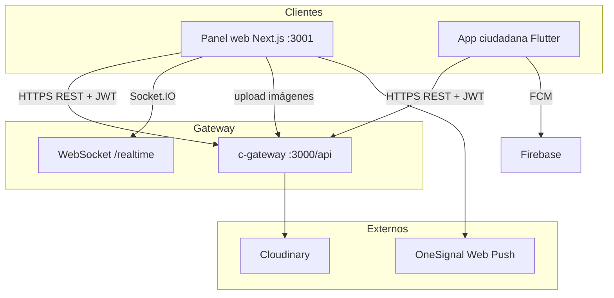

# Arquitectura del frontend — CENTINELA

Cliente web **webcentinela** (centro de comando) y referencia a la **app ciudadana Flutter**. Repo del panel: [CentinelaFrontend](https://github.com/Kaisitop/CentinelaFrontend).

> Ver también: [ARQUITECTURA_BACKEND.md](./ARQUITECTURA_BACKEND.md) · [ARQUITECTURA.md](./ARQUITECTURA.md) · [contexto.md](./contexto.md)

---

## 1. Vista general



| Aplicación | Stack | Usuarios |
|------------|-------|----------|
| **webcentinela** | Next.js 16, React 19, TypeScript, Tailwind | Admin, operador, policía |
| **App ciudadana** | Flutter | Ciudadanos (no acceden al panel) |

---

## 2. Panel web — estructura del proyecto

```
webcentinela/
├── app/                      # App Router (páginas)
│   ├── page.tsx              # Dashboard
│   ├── login/
│   ├── alertas/
│   ├── reportes/
│   ├── usuarios/
│   ├── nodos-iot/
│   ├── patrullaje/
│   └── patrullaje-map/       # Vista policía
├── components/
│   ├── alertas/              # Detalle, cierre, falsa alarma
│   ├── reportes/             # Panel lateral de reportes
│   ├── usuarios/             # Importación, baja
│   ├── patrullero/           # Mapa y cierre en campo
│   ├── nodos-iot/            # CRUD nodos
│   ├── ui/                   # shadcn/Radix
│   ├── sidebar.tsx
│   ├── auth-provider.tsx
│   └── protected-route.tsx
├── lib/                      # Lógica de negocio cliente
│   ├── api.ts                # Axios + tokens
│   ├── auth-service.ts
│   ├── core-service.ts
│   ├── media-service.ts
│   ├── use-centinela-realtime.ts
│   ├── map-markers.ts
│   └── roles.ts
└── public/                   # OneSignal workers, assets
```

---

## 3. Capas de la aplicación

### 3.1 Presentación (`app/` + `components/`)

- **App Router** de Next.js: cada carpeta en `app/` es una ruta.
- Componentes por dominio (`alertas/`, `reportes/`, etc.) + UI base en `components/ui/`.
- Tema oscuro operativo (Tailwind + `next-themes`).

### 3.2 Estado y autenticación

| Pieza | Archivo | Función |
|-------|---------|---------|
| Contexto de sesión | `auth-provider.tsx` | Usuario logueado, logout |
| Rutas protegidas | `protected-route.tsx` | Redirige a `/login` sin token |
| Roles | `lib/roles.ts` | `isAdmin`, `isPolicia`, ruta por defecto |

**Rutas por rol:**

| Rol | Ruta inicial | Acceso |
|-----|--------------|--------|
| `admin` | `/` | Todo el panel |
| `operador` | `/` | Alertas, reportes, mapa |
| `policia` | `/patrullaje` | Mapa patrullero, cierre con evidencia |
| `ciudadano` | — | **Bloqueado** en panel web |

### 3.3 Capa de servicios (`lib/`)

| Servicio | Responsabilidad |
|----------|-----------------|
| `api.ts` | Instancia Axios, `tokenStorage`, interceptores JWT y refresh |
| `auth-service.ts` | Login, registro, usuarios, deactivate |
| `core-service.ts` | Alertas, reportes, zonas, nodos, analytics |
| `media-service.ts` | Subida de fotos a `/api/media/upload` |
| `use-centinela-realtime.ts` | Socket.IO: `alerta.created`, `alerta.updated` |
| `map-markers.ts` | Iconos Leaflet por tipo de alerta |

---

## 4. Integración con el backend

### 4.1 REST API

```env
# .env.local
NEXT_PUBLIC_API_URL=http://localhost:3000/api
```

Todas las peticiones van al **gateway** (`c-gateway`), nunca directo a microservicios.

```typescript
// lib/api.ts — patrón
api.interceptors.request.use((config) => {
  const token = tokenStorage.getAccessToken();
  if (token) config.headers.Authorization = `Bearer ${token}`;
  return config;
});
```

- **Access token** en `localStorage`
- Ante **401** → refresh automático con `refreshToken`

### 4.2 Tiempo real

- Socket.IO contra `http://<host>:3000` (mismo origen del gateway)
- El hook `useCentinelaRealtime` actualiza tablas/dashboard sin recargar

### 4.3 Medios (Cloudinary)

1. `media-service.upload(file, 'reporte' | 'evidencia')`
2. Gateway sube a Cloudinary
3. URLs se guardan en `fotosUrls` (reportes) o `evidenciaUrls` (alertas)
4. `MediaGallery` renderiza en detalle de alertas/reportes

---

## 5. Pantallas principales

| Ruta | Componentes clave | Acciones del usuario |
|------|-------------------|----------------------|
| `/login` | `auth-shell` | Email + contraseña |
| `/` | `MapClient`, dashboard | Resumen, mapa de alertas/zonas |
| `/alertas` | `alerta-detail-panel`, `alerta-cierre-dialog` | Filtrar, reconocer, cerrar, falsa alarma |
| `/reportes` | `reporte-detail-panel` | Tomar caso, resolver, marcar falso |
| `/usuarios` | `usuario-import-section`, `usuario-baja-dialog` | Alta, CSV, baja |
| `/nodos-iot` | `nodos-iot-content`, `nodo-create-dialog` | Registrar nodo en mapa |
| `/patrullaje-map` | `patrullero-map-client`, `alerta-cierre-modal` | GPS, cerrar con fotos |

---

## 6. Mapas (Leaflet)

- **react-leaflet** para zonas, nodos, alertas y posición del patrullero
- `use-patrullero-gps.ts` — geolocalización del navegador
- `map-markers.ts` — pines por tipo (disparo, grito, ciudadano, etc.)
- Mapa de calor / analytics vía endpoints de `core-service`

---

## 7. Notificaciones push (panel)

| Pieza | Detalle |
|-------|---------|
| SDK | OneSignal Web v16 |
| Workers | `/push/onesignal/` (scope dedicado) |
| Componentes | `onesignal-provider`, `push-notifications-control` |
| Backend | `ms-notificaciones` + variables `ONESIGNAL_*` |

Tras login, el usuario activa push; el backend asocia el `playerId` al `usuario_id`.

---

## 8. Stack tecnológico

| Categoría | Tecnología |
|-----------|------------|
| Framework | Next.js 16 (App Router) |
| UI | React 19, Tailwind CSS, Radix UI / shadcn |
| HTTP | Axios |
| Mapas | Leaflet, react-leaflet |
| Formularios | react-hook-form + zod |
| Toasts | Sonner |
| Push | OneSignal Web SDK |

---

## 9. Flujos de usuario (panel)

### Operador — nueva alerta

```text
1. WebSocket recibe alerta.created
2. Tabla en /alertas se actualiza
3. Operador abre detalle → ve mapa, evento IA, reporte vinculado
4. Reconocer → POST /api/alertas/:id/reconocer
5. Cerrar o marcar falsa alarma (notas obligatorias)
```

### Policía — cierre en campo

```text
1. Entra a /patrullaje-map
2. Ve alertas asignadas en mapa
3. Sube evidencia (tipo=evidencia) → Cloudinary
4. Cierra alerta con notas desde alerta-cierre-modal
```

### Admin — usuarios

```text
1. /usuarios → listado
2. Alta manual o importación Excel/CSV
3. Baja lógica vía DELETE /api/auth/user/:id
```

---

## 10. App ciudadana (Flutter) — resumen

Repo separado; **no** vive en `webcentinela`.

| Función | Integración |
|---------|-------------|
| Registro / login | `POST /api/auth/*` |
| Reportes + fotos | `POST /api/reportes` + `media/upload` |
| SOS / pánico | Reporte tipo crítico → alerta automática |
| Push | Firebase FCM (`ms-notificaciones`) |
| Nodo sensor (opcional) | Publica MQTT como dispositivo de campo |

---

## 11. Despliegue local del panel

```bash
cd webcentinela
cp .env.example .env.local
# NEXT_PUBLIC_API_URL=http://<IP-LAN>:3000/api
# NEXT_PUBLIC_ONESIGNAL_APP_ID=...

npm install
npm run dev          # puerto 3001
# npm run dev:webpack  # si OneSignal falla con Turbopack
```

El backend debe estar arriba (`docker compose up`) en el puerto 3000.

---

## 12. Decisiones clave (frontend)

1. **Repo separado** del monorepo backend: ciclos de release independientes.
2. **Un solo API URL** (`NEXT_PUBLIC_API_URL`): todo pasa por el gateway.
3. **Tiempo real** vía WebSocket, no polling.
4. **Roles en UI**: sidebar y rutas adaptadas (`policia` → patrullaje).
5. **JWT en localStorage**: simple para prototipo; en producción valorar cookies `HttpOnly`.

---

## 13. Prompt para diagrama de arquitectura (imagen)

Prompts para generar un diagrama al estilo infográfico plano (como el del backend): iconos azules, etiquetas amarillas de protocolo, líneas punteadas, flujo claro.

### Prompt principal (inglés)

```text
Clean minimalist flat vector frontend architecture diagram, white/light gray background, professional tech infographic, landscape 16:9.

TOP — THREE USER ACTORS (simple person icons with role labels):
- "Admin / Operador" (desktop user)
- "Policía" (officer with map)
- "Ciudadano" (citizen with phone only — no web panel access)

CENTER LEFT — Large rounded box labeled "Panel Web — webcentinela (Next.js :3001)":
Inside the box, three horizontal layers stacked:

LAYER 1 — PAGES (small window icons):
/login, /alertas, /reportes, /usuarios, /nodos-iot, /patrullaje-map, Dashboard /

LAYER 2 — COMPONENTS (UI blocks):
Sidebar, AlertaDetailPanel, ReporteDetailPanel, MapClient (Leaflet), MediaGallery, ProtectedRoute

LAYER 3 — SERVICES lib/ (gear/document icons):
api.ts (Axios + JWT), auth-service.ts, core-service.ts, media-service.ts, useCentinelaRealtime (Socket.IO)

CENTER RIGHT — Separate rounded box labeled "App Ciudadana (Flutter — Android/iOS)":
Inside: Login, Reportes, SOS/Pánico, Fotos GPS, Notificaciones FCM
Note label: "Solo rol ciudadano"

RIGHT SIDE — EXTERNAL BACKEND & SERVICES:
- Blue gateway circle "c-gateway :3000/api"
- Cloud icon "Cloudinary" (images)
- Bell icon "OneSignal" (web push — panel only)
- Bell icon "Firebase FCM" (mobile push)

CONNECTIONS (yellow pill labels on dashed gray lines):
- Admin/Operador → HTTP → Panel Web pages
- Policía → HTTP → /patrullaje-map
- Panel Web lib/api.ts → dashed "REST + JWT Bearer" → c-gateway
- Panel Web useCentinelaRealtime → dashed "WebSocket /realtime" → c-gateway
- Panel Web media-service → dashed "multipart upload" → c-gateway → Cloudinary
- Panel Web → dashed "OneSignal SDK" → OneSignal
- Ciudadano → dashed "REST" → App Flutter → dashed "REST + JWT" → c-gateway
- App Flutter → dashed "FCM" → Firebase FCM

BOTTOM — small note box: "tokenStorage: localStorage (access + refresh)"

Style: blue (#2563EB) icons, yellow (#F59E0B) protocol tags, thin dashed lines, sans-serif labels, flat vector, no 3D, no photorealism, academic thesis quality.
```

### Prompt alternativo (español)

```text
Diagrama de arquitectura frontend CENTINELA, estilo infográfico plano minimalista, fondo blanco, horizontal.

Arriba: tres usuarios — Admin/Operador (PC), Policía (mapa), Ciudadano (solo móvil).

Caja izquierda "Panel Web Next.js puerto 3001" con tres capas:
1) Rutas: login, alertas, reportes, usuarios, nodos-iot, patrullaje-map, dashboard
2) Componentes: sidebar, paneles de detalle, mapa Leaflet, galería de fotos
3) Servicios lib: api.ts, auth-service, core-service, media-service, tiempo real WebSocket

Caja derecha "App Flutter ciudadana": reportes, SOS, fotos, push FCM. Sin acceso al panel.

Conexiones con etiquetas amarillas punteadas:
REST+JWT y WebSocket hacia c-gateway puerto 3000
Subida de imágenes hacia Cloudinary vía gateway
OneSignal para panel web, Firebase para app móvil

Iconos azules, etiquetas amarillas, sin 3D, para documento de titulación UNEMI.
```

### Notas para que el diagrama sea fiel al frontend

| Elemento | Cómo representarlo |
|----------|-------------------|
| **Dos apps** | Panel web (`webcentinela`) y app Flutter son **repos separados**, no un solo cliente. |
| **Ciudadano** | Flecha solo hacia **Flutter**, nunca hacia el panel Next.js. |
| **Policía** | Ruta principal `/patrullaje-map`, no el mismo menú que admin. |
| **Un solo backend URL** | Todo pasa por `NEXT_PUBLIC_API_URL` → `c-gateway`, no microservicios directos. |
| **Tiempo real** | Línea aparte **WebSocket** (no es REST). |
| **Fotos** | Cliente → gateway → **Cloudinary**; el panel no sube directo a Cloudinary. |
| **Push** | **OneSignal** = panel web; **FCM** = app móvil (canales distintos). |

### Variante simplificada (una sola caja — solo panel web)

Si el documento solo cubre el centro de comando:

```text
Minimalist flat diagram: Web Browser → Next.js Panel (app/ + components/ + lib/) → dashed REST+JWT and WebSocket → API Gateway :3000 → Cloudinary and OneSignal on the side. Blue icons, yellow tags, white background, 16:9.
```

### Si usas draw.io / Lucidchart

```text
[Admin/Operador] --> [Panel Web Next.js :3001]
[Policía] --> [/patrullaje-map]
[Ciudadano] --> [App Flutter] (NO conecta al panel)

Subgrafo Panel Web:
  [app/ páginas] --> [components/]
  [components/] --> [lib/api.ts + auth-service + core-service + media-service]
  [lib/use-centinela-realtime] --WebSocket--> [c-gateway :3000]
  [lib/api.ts] --REST JWT--> [c-gateway :3000]
  [media-service] --upload--> [c-gateway] --> [Cloudinary]
  [OneSignal SDK] --> [OneSignal]

Subgrafo App Flutter:
  [UI Reportes/SOS] --REST JWT--> [c-gateway :3000]
  [FCM] <-- [ms-notificaciones vía Firebase]

[localStorage: accessToken + refreshToken]
```

### Pie de figura sugerido (para el Word)

*Figura X. Arquitectura del frontend CENTINELA. El panel web (`webcentinela`, Next.js) atiende a administradores, operadores y patrulleros; la aplicación móvil Flutter es el canal exclusivo del ciudadano. Ambos clientes consumen la API REST del gateway mediante JWT; el panel además usa WebSocket para alertas en tiempo real y OneSignal para notificaciones web.*

---

## Referencias

- README del frontend: `webcentinela/README.md`
- Endpoints consumidos: `centinela-project/c-gateway/README.md`
- Convenciones generales: [contexto.md](./contexto.md)
