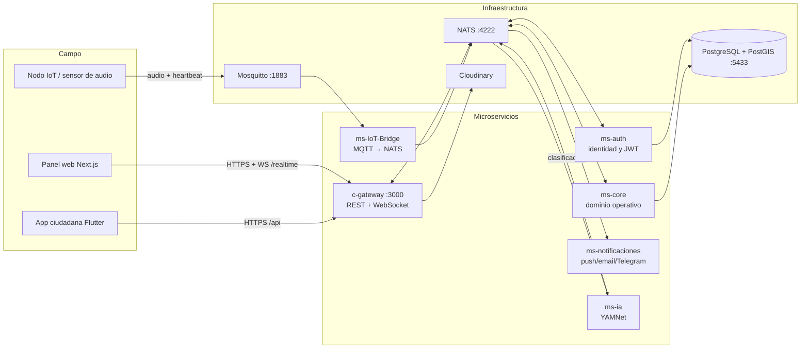

# CENTINELA — Documentación técnica del desarrollo (Backend)

> **Proyecto:** `centinela-project` · **Tipo:** Backend de microservicios
> **Institución:** UNEMI — Cantón Milagro, Guayas, Ecuador
> **Repositorio:** [Kaisitop/CentinelaProject](https://github.com/Kaisitop/CentinelaProject) (monorepo con submódulos Git)
> **Documentos relacionados:** [DOCUMENTACION_DESARROLLO_FRONTEND.md](./DOCUMENTACION_DESARROLLO_FRONTEND.md) · [contexto.md](./contexto.md) · [ARQUITECTURA_BACKEND.md](./ARQUITECTURA_BACKEND.md) · [ARQUITECTURA_FRONTEND.md](./ARQUITECTURA_FRONTEND.md) · [CENTINELA_MER_Seguridad.md](./CENTINELA_MER_Seguridad.md)

---

## 1. Introducción

### 1.1 Propósito y objetivos

**CENTINELA** es un sistema de seguridad ciudadana diseñado para el cantón Milagro (Guayas, Ecuador). Su objetivo es reducir el tiempo de respuesta ante incidentes violentos combinando tres fuentes de información:

1. **Detección acústica automática**: nodos IoT distribuidos en el territorio capturan audio ambiente y una IA (modelo YAMNet) clasifica sonidos críticos como disparos o gritos.
2. **Reportes ciudadanos**: una app móvil permite a los habitantes reportar incidentes (pánico/SOS, robos, extorsión, etc.) con ubicación GPS y fotos.
3. **Gestión operativa centralizada**: un panel web donde operadores validan alertas, despachan patrullas y cierran casos, con seguimiento GPS de los policías en tiempo real.

### 1.2 Problema que resuelve

Milagro presenta índices elevados de violencia urbana (homicidios, sicariato, extorsión, disputas entre bandas). Los mecanismos tradicionales de denuncia son lentos, dependen de llamadas telefónicas y no aprovechan evidencia objetiva del territorio. CENTINELA ataca tres brechas:

- **Detección tardía**: los disparos y gritos se detectan automáticamente, sin depender de que alguien llame.
- **Falta de georreferenciación**: cada evento, reporte y alerta queda ubicado sobre un mapa con las parroquias reales del cantón (polígonos PostGIS).
- **Descoordinación operativa**: el ciclo completo de la alerta (creación → despacho → informe en sitio → cierre) queda trazado con responsables y tiempos.

### 1.3 Público objetivo

| Actor | Rol en el sistema |
|-------|-------------------|
| **Ciudadanos** de Milagro | Reportan incidentes desde la app móvil (Flutter) |
| **Operadores** del centro de comando | Validan alertas, gestionan reportes y cierran casos desde el panel web |
| **Policías / patrulleros** | Reciben alertas cercanas, marcan "en camino", navegan con ruta y envían informe de campo |
| **Administradores** | Gestión de usuarios, mantenimiento del sistema |
| **Nodos IoT** | Dispositivos de campo que emiten audio y heartbeats vía MQTT |

### 1.4 Principales funcionalidades

- Ingesta de eventos de audio vía **MQTT** y clasificación automática con **YAMNet** (disparo, grito, sonido normal).
- Confirmación **multi-nodo** anti-falsos positivos: una detección crítica requiere confianza mínima (≥ 0,85) o corroboración de un segundo nodo en la misma zona en ~30 segundos.
- Reportes ciudadanos tipificados (pánico, homicidio/sicariato, secuestro, robo, extorsión, persona/vehículo sospechoso) con generación automática de alertas.
- Ciclo de vida de alertas con estados: `activa → en_proceso → reconocida → cerrada | falsa_alarma | completada`.
- Notificaciones multicanal: **push** (FCM para ciudadanos, OneSignal para el panel), **Telegram** (grupo de staff + canal ciudadano) y **email SMTP** (verificación de cuenta y restablecimiento de contraseña con canales separados web/app).
- Patrullaje en tiempo real: posición GPS de los policías, asignación del patrullero más cercano, ruta OSRM hacia la alerta.
- Mapa de calor de eventos, zonas con nivel de riesgo (1–5) sobre polígonos parroquiales reales del INEC.
- Subida de evidencia fotográfica a **Cloudinary** (reportes ciudadanos y evidencia policial).
- WebSocket (`Socket.IO`) para actualización del panel en vivo sin refrescar.

---

## 2. Tecnologías utilizadas (Tech Stack)

### 2.1 Backend

| Componente | Tecnología | Versión |
|------------|-----------|---------|
| Lenguaje principal | TypeScript sobre Node.js | Node 20+ |
| Framework servicios Node | **NestJS** | ^11.0 |
| Servicios Python | **FastAPI** + Uvicorn | FastAPI 0.115 |
| Mensajería interna | **NATS** (cliente `nats` ^2.29 / `nats-py` 2.9) | imagen `nats:alpine` |
| Broker IoT | **Eclipse Mosquitto** (MQTT) | imagen `eclipse-mosquitto:2` |
| ORM | **Prisma** con adaptador `pg` | ^7.8 |
| IA / audio | TensorFlow + TensorFlow Hub (**YAMNet** + clasificador propio `.h5`) | — |
| Validación | `class-validator` / `class-transformer` (Node), `pydantic-settings` (Python) | — |
| Hash de contraseñas | `bcrypt` | ^6.0 |

### 2.2 Base de datos

- **PostgreSQL 18 con PostGIS** (imagen `postgis/postgis:18-master`).
- Una sola base `centinela_db` con **dos esquemas separados**:
  - `identity` → usuarios, roles, permisos, refresh tokens (propiedad de `ms-auth`).
  - `app` → zonas, nodos, eventos, reportes, alertas, patrullaje (propiedad de `ms-core`).
- Geometrías con SRID 4326: polígonos de zonas (`geometry`), puntos de eventos/nodos, posiciones de patrulleros.

### 2.3 Autenticación y autorización

- **JWT** (access + refresh token persistido en BD) emitidos por `ms-auth`.
- Guards en `c-gateway` validan el token y **permisos granulares** por endpoint (ej. `alertas:update_status`, `usuarios:update`).
- Roles: `Admin`, `Operador`, `Policia`, `Ciudadano`. El panel web rechaza el rol Ciudadano.

### 2.4 Frontend (repos aparte, para referencia)

| Cliente | Stack |
|---------|-------|
| Panel web `webcentinela` | Next.js 16, Tailwind CSS, Leaflet, Socket.IO client, sonner, lucide-react |
| App ciudadana | Flutter (HTTP + deep links `centinela://`) |

### 2.5 Infraestructura y servicios externos

| Servicio | Uso |
|----------|-----|
| **Docker + Docker Compose** | Orquestación local de los 6 servicios + Postgres + NATS + MQTT |
| **Cloudinary** | Almacenamiento de fotos (reportes y evidencia policial), máx. 5 MB, JPEG/PNG/WebP |
| **OneSignal** | Push al panel web (operadores) |
| **Firebase Cloud Messaging** | Push a la app ciudadana |
| **Telegram Bot API** | Grupo de staff + canal público ciudadano |
| **SMTP** (Gmail u otro) | Correos de verificación y reset de contraseña |
| **OSRM** (público) | Cálculo de rutas para patrullaje (proxy en el frontend) |

### 2.6 Herramientas de desarrollo

- **Git con submódulos**: cada microservicio es un repositorio independiente; el monorepo guarda punteros SHA.
- **ESLint + Prettier** en los servicios Nest.
- **Jest** configurado por Nest CLI (scripts `test`, `test:e2e`, `test:cov`).
- IDE: cualquier editor con soporte TypeScript; el proyecto se desarrolla en Cursor/VS Code.

---

## 3. Arquitectura general

### 3.1 Tipo de arquitectura

**Microservicios orientados a eventos** con un único punto de entrada HTTP (patrón *API Gateway*). La comunicación interna es por **NATS** en dos modalidades:

- **Request/Reply (síncrono)**: el gateway traduce cada petición HTTP en un mensaje NATS y espera respuesta (`alertas.findAll`, `reportes.create`…).
- **Publish/Subscribe (asíncrono)**: los servicios emiten eventos de dominio (`alerta.created`, `email.send_password_reset`…) que otros consumen sin acoplarse.

### 3.2 Diagrama de arquitectura



### 3.3 Capas y responsabilidades

| Capa | Componentes | Responsabilidad |
|------|-------------|-----------------|
| **Entrada** | `c-gateway` | Autenticación JWT, autorización por permisos, validación de DTOs, proxy HTTP→NATS, WebSocket `/realtime`, subida a Cloudinary |
| **Dominio** | `ms-core`, `ms-auth` | Reglas de negocio: ciclo de alertas, confirmación multi-nodo, geoprocesamiento PostGIS, identidad y permisos |
| **Integración** | `ms-IoT-Bridge`, `ms-ia` | Puente MQTT→NATS, persistencia de audio, clasificación acústica |
| **Salida** | `ms-notificaciones` | Push, email, Telegram — desacoplado: si falla el envío, el dominio ya persistió |
| **Datos** | PostgreSQL/PostGIS | Persistencia con esquemas separados por contexto (`identity` / `app`) |
| **Mensajería** | NATS, Mosquitto | Transporte interno y de campo |

### 3.4 Flujo de datos principal (detección de audio)

```text
1. Nodo IoT publica audio WAV + metadatos en MQTT (topic centinela/evento)
2. ms-IoT-Bridge lo recibe, guarda el WAV en volumen compartido y emite eventos.create (NATS)
3. ms-core inserta el evento con ubicación → busca zona con ST_Contains
4. ms-ia lee el WAV, clasifica con YAMNet y emite eventos.update (subtipo, confianza, severidad)
5. ms-core evalúa ConfirmacionAlertasService:
   - subtipo crítico (disparo/grito) + confianza ≥ 0.85, o
   - segundo nodo corroborante en la misma zona en ~30 s
   → crea alerta y emite alerta.created
6. ms-notificaciones envía push al patrullero más cercano (fallback: todos los policías)
7. c-gateway retransmite alerta.created por WebSocket → el panel se actualiza en vivo
```

---

## 4. Estructura de carpetas y archivos

### 4.1 Raíz del monorepo

```text
centinela-project/
├── c-gateway/           → API Gateway (submódulo Git)
├── ms-auth/             → Autenticación, JWT, roles (submódulo)
├── ms-core/             → Dominio operativo (submódulo)
├── ms-notificaciones/   → Push, Telegram, SMTP (submódulo)
├── ms-ia/               → Clasificación de audio, Python (submódulo)
├── ms-IoT-Bridge/       → Puente MQTT → NATS, Python (submódulo)
├── docs/                → Arquitectura, contexto, MER, requisitos
├── docker-compose.yml   → Orquestación local completa
├── .env.example         → Plantilla de variables (copiar a .env)
└── README.md            → Guía de clonado y submódulos
```

### 4.2 Servicios NestJS (convención común)

Todos los servicios Nest (`c-gateway`, `ms-auth`, `ms-core`, `ms-notificaciones`) siguen la misma anatomía:

```text
<servicio>/
├── src/
│   ├── main.ts              → Bootstrap (HTTP en gateway; microservicio NATS en el resto)
│   ├── app.module.ts        → Módulo raíz que importa los módulos de dominio
│   ├── config/              → envs.ts: lectura y validación de variables de entorno
│   └── <dominio>/           → Un módulo Nest por dominio (controller/service/module)
│       └── dto/             → Data Transfer Objects con class-validator
├── prisma/                  → schema.prisma + seed.ts (solo ms-auth y ms-core)
├── generated/prisma/        → Cliente Prisma generado (excluido del build)
├── docker-entrypoint.sh     → Espera Postgres → prisma db push → seed → arranque
├── Dockerfile
└── package.json
```

**Módulos por servicio:**

| Servicio | Módulos en `src/` |
|----------|-------------------|
| `c-gateway` | `auth`, `alertas`, `reportes`, `zonas`, `nodos`, `eventos`, `media`, `realtime`, `patrullaje`, `analytics`, `notificaciones`, `admin`, `common` (guards, decorators, interceptors, exceptions), `transports` (cliente NATS), `config` |
| `ms-auth` | `auth` (login, refresh, reset, verificación, usuarios), `audit`, `dispositivos` (tokens push), `maintenance`, `prisma`, `config` |
| `ms-core` | `zonas`, `nodos`, `eventos` (incluye `confirmacion-alertas.service.ts`), `reportes` (incluye `constants/reporte-tipos.ts`), `alertas`, `patrullaje`, `analytics`, `notificaciones`, `maintenance`, `prisma`, `common`, `config` |
| `ms-notificaciones` | `notificaciones` (push/Telegram), `email` (SMTP + plantillas), `config` |

### 4.3 Servicios Python

```text
ms-ia/
├── main.py                  → FastAPI + suscripción NATS
├── inference/
│   ├── engine.py            → Carga del modelo, clasificación, severidad sugerida
│   └── classifier.py        → Wrapper YAMNet + clasificador propio
├── services/
│   └── audio_processor.py   → Consume evento, lee WAV, emite eventos.update
└── models/                  → my_yamnet_classifier.h5 (copiar manualmente)

ms-IoT-Bridge/
├── main.py                  → Bootstrap FastAPI + MQTT + NATS
├── mqtt/                    → Suscriptor Mosquitto (topic centinela/evento)
├── services/                → Persistencia de audio, heartbeats en BD
└── models/                  → Esquemas pydantic
```

### 4.4 Archivos clave

| Archivo | Propósito |
|---------|-----------|
| `docker-compose.yml` | Define 9 contenedores: postgres, nats, mqtt, 4 servicios Nest, 2 Python; healthchecks y volumen `shared_audio` |
| `ms-core/prisma/schema.prisma` | Modelo de datos del esquema `app` (zonas con `geometry`, alertas, eventos…) |
| `ms-core/prisma/zonas_milagro.json` | Seed de las 4 parroquias con polígonos reales (WKT) y nivel de riesgo |
| `ms-core/src/reportes/constants/reporte-tipos.ts` | Catálogo de tipos de reporte con prioridad/severidad |
| `ms-core/src/eventos/confirmacion-alertas.service.ts` | Lógica anti-falsos positivos multi-nodo |
| `ms-ia/inference/engine.py` | Severidad sugerida por la IA (disparo=3, grito=2) |
| `c-gateway/src/realtime/` | Gateway Socket.IO que retransmite eventos NATS al panel |
| `ms-notificaciones/src/email/email-templates.util.ts` | Plantillas HTML de correos (canal web vs app) |

### 4.5 Convenciones de nombrado

- **Tablas**: snake_case en BD, camelCase en Prisma con `@map` (ej. `riesgo_nivel` ↔ `riesgoNivel`).
- **Patrones NATS**: `<entidad>.<acción>` (`alertas.updateStatus`, `eventos.create`, `patrullaje.findNearest`).
- **Eventos de dominio**: `<entidad>.<pasado>` (`alerta.created`, `reporte.updated`).
- **Estados**: minúsculas con guion bajo en alertas (`en_proceso`, `falsa_alarma`); MAYÚSCULAS en reportes (`PENDIENTE`, `EN_PROCESO`, `RESUELTO`, `FALSO`).
- **Contenedores Docker**: prefijo `centinela-` (`centinela-db`, `centinela-gateway`…).

---

## 5. Cómo funciona la aplicación

### 5.1 Flujos de usuario (user journeys)

**Ciudadano (app móvil):**
1. Se registra → recibe email de verificación → inicia sesión.
2. Presencia un incidente → abre la app → elige tipo (ej. Robo) → describe, adjunta fotos, la app envía GPS.
3. `ms-core` asigna la zona por geometría y, al ser tipo crítico, **genera una alerta automáticamente**.
4. Recibe push de estado cuando el caso avanza; puede seguir el canal ciudadano de Telegram.

**Operador (panel web):**
1. Inicia sesión en el panel (roles panel: Admin/Operador/Policia).
2. Ve la alerta nueva en tiempo real (WebSocket) con severidad, zona, confianza IA y evidencia.
3. Supervisa: el patrullero más cercano ya recibió push; puede reconocer o cerrar directamente.
4. Al cerrar (resuelta o falsa alarma), documenta notas; el reporte ciudadano vinculado se actualiza en cascada.

**Patrullero (vista móvil `/patrullaje`):**
1. Activa su GPS en el panel; su posición se publica por WebSocket.
2. Recibe push de alerta cercana → pulsa **"En camino"** (estado `en_proceso`) → obtiene ruta OSRM en el mapa.
3. Al llegar, envía **informe en sitio** con evidencia fotográfica (estado `reconocida`).
4. El operador valida y cierra. Si el operador cierra antes, la ruta del patrullero se cancela sola vía WebSocket.

### 5.2 Autenticación y manejo de sesiones

- Login → `ms-auth` valida credenciales (bcrypt) → emite **access token JWT** (corto) + **refresh token** persistido en `identity.refresh_tokens`.
- El gateway valida el JWT en cada request (guard global) y consulta los permisos del rol.
- Refresh: el cliente renueva el access token sin re-login; logout revoca el refresh token.
- **Reset de contraseña con dos canales**: `channel: 'web'` envía enlace al panel (`/reset-password?token=`); `channel: 'app'` envía enlace bridge (`/api/auth/reset-password/open`) que abre el deep link `centinela://`. Si no se especifica, se infiere por rol (roles de panel → web).

### 5.3 Procesos críticos

**Confirmación de alertas de audio (anti-falsos positivos):**
- Solo subtipos críticos (`disparo`, `grito`) califican.
- Se exige confianza IA ≥ 0,85 **o** un segundo nodo en la misma zona dentro de la ventana (~30 s).
- En desarrollo, `ALERT_SINGLE_NODE_BYPASS=true` permite probar con un solo nodo.
- Dedup: mismo nodo+zona+subtipo no genera otra alerta abierta en 60 s (`ALERT_DEDUP_WINDOW_SEC`).

**Escala de severidad/prioridad (1–5):**

| Origen | Valores |
|--------|---------|
| Reporte ciudadano | Pánico/Homicidio/Secuestro = **4** · Robo/Extorsión = **3** · Sospechosos = **2** |
| Audio IA | Disparo = **3** · Grito u otro sonido de alerta = **2** · Normal = **1** |

Decisión de diseño: la confirmación humana activa (botón SOS) pesa más que la clasificación acústica probabilística; por eso la IA entra un escalón por debajo y además pasa el filtro de confirmación. Detalle en [contexto.md](./contexto.md#severidad-y-prioridad-escala-1-5).

**Zonas y nivel de riesgo:** los polígonos parroquiales provienen del Geoportal del INEC (GeoPackage) y cada zona tiene `riesgo_nivel` 1–5 según evaluación de incidencia criminal (Milagro 4, Roberto Astudillo 4, Chobo 3, Mariscal Sucre 3).

### 5.4 Integraciones externas

| Integración | Dirección | Detalle |
|-------------|-----------|---------|
| Cloudinary | Backend → SaaS | `POST /api/media/upload?tipo=reporte\|evidencia`; carpetas `centinela/ciudadano/AAAA-MM-DD` y `centinela/policial/…` |
| OneSignal | `ms-notificaciones` → SaaS | Push al panel del operador |
| FCM (Firebase) | `ms-notificaciones` → SaaS | Push a la app; credencial JSON montada como volumen de solo lectura |
| Telegram | `ms-notificaciones` → Bot API | Mensajes al grupo staff y canal ciudadano |
| SMTP | `ms-notificaciones` → servidor de correo | Verificación y reset; plantillas HTML propias |
| OSRM | Frontend (proxy `/api/routing`) | Ruta del patrullero a la alerta |

### 5.5 Manejo de errores y logging

- **Errores de dominio**: los microservicios lanzan `RpcException` con `{ status, message }`; el gateway los traduce a respuestas HTTP con el código correcto (filtro de excepciones común).
- **Validación**: DTOs con `class-validator` en el gateway y en los servicios; entradas inválidas se rechazan con 400 antes de tocar el dominio.
- **Logging**: `Logger` de NestJS por servicio (visible con `docker compose logs -f <servicio>`); los servicios Python usan logging estándar.
- **Aislamiento de fallos**: las notificaciones son *fire-and-forget* — si OneSignal/SMTP/Telegram fallan, la alerta ya está persistida y el panel la muestra igual.
- **Healthchecks**: Postgres (`pg_isready`) y NATS (`/healthz` en :8222) bloquean el arranque de los servicios hasta estar sanos.

---

## 6. Decisiones técnicas importantes

| Decisión | Razón | Trade-off aceptado |
|----------|-------|--------------------|
| **Microservicios + NATS** en lugar de monolito | Aislamiento de fallos (la IA puede caerse sin tumbar alertas), desarrollo paralelo por servicio | Más complejidad operativa; se mitiga con Docker Compose y healthchecks |
| **Un solo Postgres con 2 esquemas** (`identity`/`app`) | Cumplimiento estructural LOPDP (datos personales separados del flujo operativo) sin costo de 2 instancias | No hay aislamiento físico total; suficiente para el alcance actual |
| **PostGIS** para todo lo geográfico | `ST_Contains` asigna zona automáticamente; polígonos reales del INEC; consultas de cercanía para despacho | Requiere imagen Docker específica y SQL crudo en algunos casos (Prisma no soporta `geometry` nativo → `Unsupported`) |
| **API Gateway único** (`c-gateway`) | Un solo punto de autenticación/autorización y de exposición pública; los microservicios no abren puertos | El gateway es punto único de fallo; aceptable en despliegue actual |
| **MQTT en el borde + NATS interno** | MQTT tolera conectividad débil de los nodos de campo; NATS es más rico para request/reply interno | Dos brokers que mantener; el puente (`ms-IoT-Bridge`) los desacopla |
| **Confirmación multi-nodo para alertas IA** | La clasificación acústica es probabilística; exigir corroboración reduce drásticamente falsos positivos | Puede retrasar alertas reales ~30 s; existe bypass configurable |
| **Severidad: humano > IA** | El botón SOS es confirmación activa; un "disparo" de YAMNet puede ser un petardo | Un disparo real de un solo nodo entra con severidad 3, no 4 |
| **Git submódulos** | Cada servicio se versiona y despliega de forma independiente; el monorepo garantiza combinaciones reproducibles (punteros SHA) | Flujo de trabajo con dos commits (servicio + puntero) |
| **Prisma 7 + adaptador pg** | Tipado fuerte, migraciones simples con `db push` + seed | Sin soporte nativo PostGIS; se usa `$queryRaw` para geometrías |
| **Notificaciones desacopladas por eventos** | El dominio no espera a proveedores externos lentos | Entrega *best-effort*; no hay reintentos persistentes aún |

**Patrones de diseño utilizados:** API Gateway, mensajería Pub/Sub y Request/Reply, DTOs + validación declarativa, inyección de dependencias (NestJS), Repository implícito vía Prisma, plantillas de email como funciones puras, seeds idempotentes (`ON CONFLICT DO UPDATE`).

**Escalabilidad:** NATS permite escalar horizontalmente cada microservicio por separado (colas de suscripción); la BD es el único recurso compartido con estado. El diseño actual prioriza simplicidad de despliegue (una VM con Docker Compose) sobre alta disponibilidad.

---

## 7. Instalación y ejecución local

### 7.1 Requisitos previos

- **Docker Desktop** (o Docker Engine + Compose v2)
- **Git** con soporte de submódulos
- **Node.js 20+** y **npm** (solo si vas a desarrollar fuera de Docker)
- El modelo de IA `my_yamnet_classifier.h5` (se copia manualmente, no está en el repo)
- Cuenta de Cloudinary y credenciales SMTP (Gmail con App Password funciona)

### 7.2 Clonado

```bash
git clone --recurse-submodules https://github.com/Kaisitop/CentinelaProject.git
cd CentinelaProject

# Si ya clonaste sin submódulos:
git submodule update --init --recursive
```

### 7.3 Configuración

```bash
cp .env.example .env
# Editar .env y completar como mínimo: SMTP_*, MAIL_FROM, CLOUDINARY_*
# Copiar el modelo de IA:
#   ms-ia/models/my_yamnet_classifier.h5
# Credencial FCM (push app):
#   ms-notificaciones/secrets/firebase-service-account.json
```

**Variables de entorno principales** (`.env` raíz):

| Variable | Obligatoria | Descripción |
|----------|-------------|-------------|
| `POSTGRES_USER/PASSWORD/DB` | Sí (con defaults) | Credenciales de la BD |
| `JWT_SECRET` | Sí | Firma de tokens (cambiar en producción) |
| `SMTP_HOST/PORT/SECURE/USER/PASS`, `MAIL_FROM` | Sí | Envío de correos |
| `PUBLIC_WEB_URL` | Sí | URL del panel (enlaces en emails, canal web) |
| `PUBLIC_API_URL` | Sí | URL pública del gateway (bridge reset app) |
| `CORS_ORIGINS` | Sí | Orígenes permitidos HTTP + WebSocket |
| `CLOUDINARY_CLOUD_NAME/API_KEY/API_SECRET/FOLDER` | Sí para fotos | Credenciales Cloudinary |
| `APP_RESET_URL`, `ANDROID_APP_PACKAGE` | Con default | Deep link de la app ciudadana |
| `ALERT_SINGLE_NODE_BYPASS` | Con default (`true`) | `true` = 1 nodo basta (pruebas); `false` = exige 2º nodo |
| `ALERT_DEDUP_WINDOW_SEC` | Con default (60) | Ventana de deduplicación de alertas |
| `ONESIGNAL_*`, `TELEGRAM_*` | Opcionales | Push panel y Telegram |

### 7.4 Arranque

```bash
docker compose up --build -d
```

Cada servicio Nest con BD ejecuta al arrancar: espera de Postgres → `prisma db push` → seed (zonas de Milagro, nodos, usuarios).

**Usuarios seed (desarrollo):**

| Rol | Email | Contraseña |
|-----|-------|------------|
| Admin | `admin@centinela.com` | `Admin123!` |
| Operador | `operador@centinela.com` | `Operador123!` |
| Policía | `policia@centinela.com` | `Policia123!` |

**Frontend** (repo aparte):

```bash
cd ../webcentinela
cp .env.example .env.local   # NEXT_PUBLIC_API_URL=http://localhost:3000/api, NEXT_PUBLIC_WS_ENABLED=true
npm install && npm run dev   # http://localhost:3001
```

### 7.5 Puertos locales

| Servicio | Puerto host |
|----------|-------------|
| `c-gateway` (REST `/api` + WS `/realtime`) | 3000 |
| PostgreSQL | 5433 → 5432 |
| NATS | 4222 (+ monitor 8222) |
| MQTT | 1883 |
| Panel web (Next.js dev) | 3001 |

### 7.6 Comandos útiles

```bash
docker compose logs -f ms-core            # Logs de un servicio
docker compose build ms-core && docker compose up -d ms-core   # Rebuild tras cambios
docker exec -it centinela-db psql -U postgres -d centinela_db  # Consola SQL
docker compose down                        # Parar todo (agregar -v para borrar datos)

# Dentro de un microservicio Nest (desarrollo sin Docker):
npm run start:dev                          # Hot reload
npm run lint                               # ESLint
npx prisma studio                          # Explorador visual de la BD
```

> **Importante:** los contenedores usan imágenes construidas, no volúmenes de código. Tras editar un servicio hay que reconstruir su imagen (`docker compose build <servicio>`).

---

## 8. Despliegue (Deployment)

El despliegue actual es **self-hosted con Docker Compose** (misma topología que desarrollo) sobre una VM o servidor local:

1. Clonar con submódulos y configurar `.env` con valores de producción:
   - `JWT_SECRET` fuerte y único.
   - `PUBLIC_WEB_URL` / `PUBLIC_API_URL` con el dominio/IP real (los emails y deep links dependen de esto).
   - `CORS_ORIGINS` restringido al dominio del panel.
   - `ALERT_SINGLE_NODE_BYPASS=false` para exigir confirmación multi-nodo real.
2. Copiar el modelo `my_yamnet_classifier.h5` y el JSON de Firebase.
3. `docker compose up --build -d`.
4. El panel Next.js se despliega aparte (Vercel o Node propio) apuntando `NEXT_PUBLIC_API_URL` al gateway.

**Consideraciones de producción:**

- Poner un reverse proxy con TLS (Nginx/Caddy/Traefik) delante del puerto 3000.
- Volumen `postgres_data` incluido; respaldar con `pg_dump` periódico.
- Los healthchecks de NATS y Postgres ya ordenan el arranque; `restart: unless-stopped` es recomendable añadirlo en producción.
- Actualización: `git pull --recurse-submodules` → `docker compose build` → `docker compose up -d`.

---

## 9. Testing

### 9.1 Estado actual

- Los servicios NestJS incluyen la infraestructura de **Jest** generada por Nest CLI (`npm run test`, `test:e2e`, `test:cov`), pero el proyecto **no cuenta aún con suites de tests automatizados escritas** — es la principal deuda técnica declarada (ver roadmap).
- La verificación se realiza mediante **pruebas funcionales manuales** documentadas por servicio. `ms-core/README.md` incluye la lista de verificación end-to-end:

```text
1. Crear zona → 2. Crear nodo → 3. Enviar heartbeat → 4. Crear evento con GPS
5. Verificar zonaId asignada → 6. Verificar alerta si severidad ≥ 2 o subtipo crítico
7. Reconocer y cerrar alerta
```

- Para el flujo IoT existe un **simulador de nodo** (publicación MQTT con WAV de prueba) y el bypass `ALERT_SINGLE_NODE_BYPASS=true` que permite probar con un solo dispositivo.
- Herramientas de apoyo: colecciones HTTP (Postman/Bruno) contra `http://localhost:3000/api`, y la utilidad de panel "Cerrar todas (pruebas)" para limpiar alertas abiertas.

### 9.2 Cómo correr los tests (una vez existan)

```bash
cd ms-core          # o el servicio que corresponda
npm run test        # unitarios
npm run test:e2e    # end-to-end
npm run test:cov    # cobertura
```

---

## 10. Próximos pasos / Roadmap

1. **Tests automatizados**: unitarios para `ConfirmacionAlertasService`, `reporte-tipos` y transiciones de estado de alertas; e2e del flujo reporte→alerta→cierre.
2. **CI/CD**: pipeline (GitHub Actions) con lint + build + test por submódulo y build de imágenes.
3. **Reintentos persistentes en notificaciones**: cola con backoff para push/email fallidos.
4. **Métricas y observabilidad**: Prometheus/Grafana o al menos endpoints `/health` unificados.
5. **Refinamiento de severidad IA**: severidad 4 para disparo con confirmación cruzada de dos nodos.
6. **Gestión de flotas de nodos**: aprovisionamiento y monitoreo de nodos IoT desde el panel admin.
7. **Hardening de producción**: TLS, rate limiting en el gateway, rotación de secretos, backups automatizados.

---

*Documento generado a partir del código y la configuración reales del proyecto (julio 2026). Ante discrepancias, el código fuente es la referencia canónica; reportar la diferencia para actualizar este documento.*
