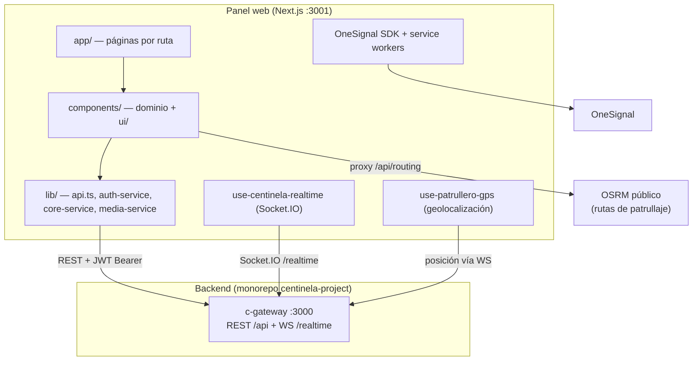

# CENTINELA — Documentación técnica del desarrollo (Frontend)

> **Proyecto:** `webcentinela` (panel web / centro de comando) · **Tipo:** Frontend web
> **Institución:** UNEMI — Cantón Milagro, Guayas, Ecuador
> **Repositorio:** [Kaisitop/CentinelaFrontend](https://github.com/Kaisitop/CentinelaFrontend) (repo independiente del monorepo backend)
> **Documentos relacionados:** [DOCUMENTACION_DESARROLLO.md](./DOCUMENTACION_DESARROLLO.md) (backend) · [ARQUITECTURA_FRONTEND.md](./ARQUITECTURA_FRONTEND.md) · [contexto.md](./contexto.md)

---

## 1. Introducción

### 1.1 Propósito y objetivos

**webcentinela** es el panel web del sistema de seguridad ciudadana CENTINELA: el **centro de comando** donde el personal operativo (administradores, operadores y policías) gestiona todo lo que ocurre en el cantón Milagro. Sus objetivos:

- Mostrar en **tiempo real** las alertas generadas por la IA acústica y los reportes ciudadanos, sin necesidad de refrescar la página.
- Dar al operador las herramientas para **validar, despachar y cerrar** cada caso con trazabilidad completa.
- Ofrecer al policía una **vista móvil de patrullaje** con GPS propio, navegación con ruta hacia la alerta e informe de campo con evidencia fotográfica.
- Administrar el sistema: usuarios, nodos IoT, zonas y mantenimiento.

### 1.2 Problema que resuelve

Sin un panel centralizado, los datos del backend (eventos de audio, reportes con GPS, posiciones de patrullas) serían inaccesibles para quien debe actuar. El panel convierte ese flujo de datos en **decisiones operativas**: un mapa común, colas de trabajo priorizadas por severidad y un ciclo de alerta con responsables claros.

### 1.3 Público objetivo

| Rol | Ruta inicial | Qué hace en el panel |
|-----|--------------|----------------------|
| **Admin** | `/` | Todo: usuarios, nodos, mantenimiento, purga de datos demo |
| **Operador** | `/` | Dashboard, alertas, reportes, mapa, cierre de casos |
| **Policía** | `/patrullaje` | GPS propio, "en camino", ruta OSRM, informe en sitio |
| **Ciudadano** | — | **Bloqueado**: el login del panel rechaza este rol (usa la app Flutter) |

### 1.4 Principales funcionalidades

- **Dashboard** con métricas en vivo: eventos detectados, alertas abiertas, nodos en línea, reportes pendientes, mapa de zonas/nodos/alertas, eventos por tipo (24 h) y ranking de zonas por nivel de riesgo.
- **Gestión de alertas**: filtros por estado/tipo/severidad/fecha (por defecto muestra "Hoy"), tarjetas de resumen clicables, detalle con evidencia, reconocimiento y cierre con notas obligatorias.
- **Gestión de reportes ciudadanos**: lista con búsqueda y filtros, panel de detalle con fotos, tomar caso, resolver o marcar falso.
- **Patrullaje**: mapa Leaflet con posición GPS del policía publicada por WebSocket, flujo "en camino → informe en sitio", ruta OSRM que se cancela sola si el operador cierra la alerta.
- **Usuarios** (admin): alta manual, importación masiva CSV/Excel (`xlsx`), baja lógica.
- **Nodos IoT**: registro y ubicación de nodos en el mapa, estado por heartbeat.
- **Notificaciones push** en el navegador (OneSignal) y **actualización en tiempo real** vía Socket.IO.
- **Flujo completo de cuenta**: login, registro, verificación de email, recuperación de contraseña (canal web separado del deep link de la app).

---

## 2. Tecnologías utilizadas (Tech Stack)

| Categoría | Tecnología | Versión |
|-----------|-----------|---------|
| Framework | **Next.js** (App Router, Turbopack) | 16.2 |
| UI | **React** | 19 |
| Lenguaje | **TypeScript** | 5.7 |
| Estilos | **Tailwind CSS** | 4.2 |
| Componentes base | **Radix UI** (shadcn/ui) + `class-variance-authority`, `clsx`, `tailwind-merge` | — |
| Iconos | **lucide-react** | ^0.564 |
| HTTP | **Axios** (interceptores JWT + refresh) | ^1.17 |
| Tiempo real | **socket.io-client** | ^4.8 |
| Mapas | **Leaflet** + **react-leaflet** | 1.9 / 5.0 |
| Geometrías | **wellknown** (WKT → GeoJSON para zonas PostGIS) | ^0.5 |
| Formularios | **react-hook-form** + **zod** | 7.5 / 3.24 |
| Gráficas | **recharts** | 2.15 |
| Toasts | **sonner** | ^1.7 |
| Push web | **react-onesignal** (OneSignal Web SDK v16) | ^3.0 |
| Import masivo | **xlsx** | ^0.18 |
| Fechas | **date-fns** | 4.1 |

**Backend consumido:** exclusivamente el API Gateway del monorepo (`c-gateway`, puerto 3000) — REST `/api/*` y WebSocket `/realtime`. El panel **nunca** habla directo con microservicios ni con la base de datos.

**Herramientas de desarrollo:** ESLint 9, dev server en puerto 3001 (`next dev -p 3001`), variantes `dev:webpack` (si OneSignal falla con Turbopack) y `dev:https` (para probar geolocalización que exige contexto seguro).

---

## 3. Arquitectura general

### 3.1 Tipo de arquitectura

**SPA/SSR híbrida con App Router de Next.js**, organizada en tres capas dentro del cliente:

1. **Presentación**: páginas (`app/`) y componentes por dominio (`components/`).
2. **Servicios de cliente** (`lib/*-service.ts`): encapsulan las llamadas HTTP; los componentes nunca usan Axios directo.
3. **Estado transversal**: contexto de autenticación, hooks de tiempo real, GPS y preferencias.

Casi todas las páginas son **Client Components** (`"use client"`): el panel es una aplicación operativa autenticada donde el SEO no aporta, y el estado en vivo (WebSocket, GPS) exige ejecución en el navegador.

### 3.2 Diagrama de arquitectura



### 3.3 Flujo de datos principal

```text
1. Página monta → servicio de lib/ pide datos al gateway (Axios + JWT)
2. useCentinelaRealtime se suscribe a eventos (alerta.created, reporte.updated…)
3. Al llegar un evento WebSocket → re-fetch de los datos afectados → UI se actualiza
4. Acciones del usuario (reconocer, cerrar, resolver) → POST al gateway → toast de resultado
5. El backend emite el evento correspondiente → todos los paneles abiertos se sincronizan
```

---

## 4. Estructura de carpetas y archivos

### 4.1 Vista general

```text
webcentinela/
├── app/                       → App Router: cada carpeta es una ruta
│   ├── page.tsx               → Dashboard principal
│   ├── layout.tsx             → Layout raíz (providers, fuentes, tema)
│   ├── login/ · register/     → Autenticación
│   ├── verify-email/          → Verificación de cuenta (token por email)
│   ├── forgot-password/ · reset-password/ → Recuperación de contraseña (canal web)
│   ├── alertas/               → Gestión de alertas (operador)
│   ├── reportes/              → Reportes ciudadanos
│   ├── patrullaje/            → Vista policía (GPS, ruta, informe)
│   ├── patrullaje-map/        → Mapa de patrullaje a pantalla completa
│   ├── nodos-iot/             → CRUD de nodos IoT
│   ├── usuarios/              → Gestión de usuarios (admin)
│   ├── configuracion/         → Cuenta, push, capas de mapa, mantenimiento
│   └── api/routing/           → Route Handler: proxy hacia OSRM (evita CORS)
├── components/
│   ├── ui/                    → Base shadcn/Radix (button, dialog, select…)
│   ├── alertas/               → Detalle, diálogo de cierre, galería
│   ├── reportes/              → reporte-detail-panel
│   ├── patrullaje/            → patrullaje-content (vista policía completa)
│   ├── patrullero/            → Mapa del patrullero, modal de cierre en campo
│   ├── nodos-iot/ · usuarios/ · configuracion/ · auth/ → por dominio
│   ├── sidebar.tsx            → Navegación con badges en vivo (alertas abiertas)
│   ├── auth-provider.tsx      → Contexto de sesión (usuario, logout)
│   ├── protected-route.tsx    → Redirige a /login sin token válido
│   ├── Map.tsx / MapClient.tsx → Mapa Leaflet (import dinámico, sin SSR)
│   └── onesignal-provider.tsx → Inicialización push
├── lib/                       → Lógica de negocio del cliente
├── public/                    → Assets + service workers de OneSignal (/push/onesignal/)
└── package.json
```

### 4.2 La capa `lib/` en detalle

| Archivo | Responsabilidad |
|---------|-----------------|
| `api.ts` | Instancia Axios, `tokenStorage` (localStorage), interceptor que adjunta el Bearer y **refresh automático ante 401**; `getApiErrorMessage()` para errores legibles |
| `auth-service.ts` | Login, registro, refresh, forgot/reset password (envía `channel: "web"`), gestión de usuarios |
| `core-service.ts` | Tipos e interfaces del dominio (`Alerta`, `Reporte`, `Zona`, `Nodo`, `Evento`) y todas las llamadas: alertas (reconocer, en-camino, cerrar), reportes (tomar, resolver, falso), zonas, nodos, analytics |
| `admin-service.ts` | Endpoints de mantenimiento (purga de datos demo) |
| `media-service.ts` | Subida de fotos a `/api/media/upload?tipo=reporte\|evidencia` (Cloudinary vía gateway) |
| `use-centinela-realtime.ts` | Hook Socket.IO: mapa de `evento → callback`, reconexión, habilitado con `NEXT_PUBLIC_WS_ENABLED` |
| `use-patrullero-gps.ts` | Geolocalización del navegador y publicación de posición |
| `routing.ts` + `app/api/routing` | Cálculo de ruta OSRM (distancia, duración, polilínea) |
| `zona-geometry.ts` | Convierte WKT de PostGIS a GeoJSON para pintar polígonos en Leaflet |
| `map-markers.ts` / `map-markers-meta.ts` | Iconos y colores de pines por tipo (disparo, grito, ciudadano, nodo, patrullero) |
| `alert-utils.ts` / `alert-date-utils.ts` | Helpers de presentación: subtipo, confianza IA, informe de campo, rangos de fecha (presets Hoy/7d/30d) |
| `roles.ts` | `isAdmin`, `isPolicia`, ruta inicial por rol |
| `user-preferences.ts` / `use-user-preferences.ts` | Preferencias locales (intervalo de refresco, capas de mapa) |
| `parse-media-urls.ts` | Normaliza el campo `fotosUrls`/`evidenciaUrls` (string JSON) a array |

### 4.3 Convenciones de nombrado

- Páginas: `app/<ruta>/page.tsx`; componentes de dominio en `components/<dominio>/kebab-case.tsx`.
- Hooks con prefijo `use-`; servicios con sufijo `-service.ts`.
- Paleta fija del tema oscuro operativo (clases Tailwind arbitrarias): fondo `#0f172a`, tarjetas `#1e293b`, bordes `#334155`, texto secundario `#94a3b8`, acento índigo `#6366f1`; semánticos: rojo `#ef4444` (activa/alta), ámbar `#f59e0b` (reconocida/media), verde `#22c55e` (cerrada/ok), celeste `#0ea5e9` (en camino), gris `#64748b` (falsa alarma).
- Estados de alerta en minúsculas (`en_proceso`), estados de reporte en mayúsculas (`EN_PROCESO`) — espejo del backend.

---

## 5. Cómo funciona la aplicación

### 5.1 Flujo de usuario completo (operador)

```text
1. /login → auth-service.login() → tokens en localStorage → AuthProvider carga el usuario
2. Redirección por rol (roles.ts): operador → dashboard /
3. El dashboard pinta métricas y mapa; useCentinelaRealtime abre el socket
4. Llega alerta.created → toast "Nueva alerta operativa" + re-fetch → aparece en vivo
5. El operador abre /alertas (filtro "Hoy" por defecto) → detalle → ve evento IA,
   confianza, zona, evidencia y reporte vinculado
6. Cierra el caso (o falsa alarma) con notas → POST /api/alertas/:id/cerrar
7. El backend emite alerta.updated → el panel del patrullero cancela su ruta activa
```

### 5.2 Flujo del policía (vista `/patrullaje`)

```text
1. Activa su GPS (use-patrullero-gps) → posición publicada al gateway → visible para operadores
2. Alerta cercana → botón "En camino" → POST /api/alertas/:id/en-camino (estado en_proceso)
3. Se calcula la ruta OSRM (proxy /api/routing) y se dibuja en el mapa con distancia/tiempo
4. Al llegar → "informe en sitio": texto + fotos (media-service, tipo=evidencia) → estado reconocida
5. Si el operador cierra la alerta antes, el evento alerta.updated borra la ruta automáticamente
```

### 5.3 Autenticación y manejo de sesión

- **Access token + refresh token** en `localStorage` (`tokenStorage` en `lib/api.ts`).
- Interceptor de request añade `Authorization: Bearer <token>`; interceptor de response detecta **401**, ejecuta el refresh una sola vez y reintenta la petición original; si el refresh falla → logout y redirección a `/login`.
- `ProtectedRoute` envuelve cada página privada; `AuthProvider` expone el usuario y su rol.
- El login **rechaza el rol Ciudadano** (la app Flutter es su canal).
- Recuperación de contraseña: el formulario del panel envía `channel: "web"`, de modo que el email recibido enlaza a `/reset-password` del propio panel (no al deep link de la app).

### 5.4 Procesos críticos

- **Tiempo real sin recarga**: todos los módulos (dashboard, alertas, reportes, patrullaje, sidebar) se suscriben a eventos WebSocket y hacen re-fetch selectivo. Si `NEXT_PUBLIC_WS_ENABLED=false`, el panel sigue funcionando con refresco por intervalo (preferencia del usuario).
- **Mapas sin SSR**: Leaflet requiere `window`; los mapas se cargan con `next/dynamic` y `ssr: false` para evitar errores de hidratación.
- **Subida de evidencia**: el cliente manda `multipart/form-data` al gateway, que sube a Cloudinary y devuelve URLs; el panel nunca conoce las credenciales de Cloudinary.
- **Importación de usuarios**: el admin sube CSV/Excel, se parsea en el navegador con `xlsx` y se envía por lotes al backend.

### 5.5 Manejo de errores y feedback

- Toda acción muestra **toast** (sonner) de éxito o error; `getApiErrorMessage()` extrae el mensaje real del backend con fallback genérico.
- Cargas con `Promise.allSettled`: si un endpoint falla, el resto del dashboard se pinta igual y el error va a consola.
- Estados de carga y vacío explícitos en cada lista (spinner, mensaje con acción para restablecer filtros).

---

## 6. Decisiones técnicas importantes

| Decisión | Razón | Trade-off |
|----------|-------|-----------|
| **Repo separado** del monorepo backend | Ciclos de release independientes; el monorepo solo orquesta backend | Coordinación manual de contratos API |
| **Next.js App Router con Client Components** | Panel autenticado y en vivo: WebSocket, GPS y Leaflet exigen navegador; SEO irrelevante | Se renuncia a la mayor parte del beneficio SSR |
| **Una sola URL de backend** (`NEXT_PUBLIC_API_URL`) | Todo pasa por el gateway: un punto de auth y CORS | El gateway es dependencia única |
| **JWT en localStorage** | Simplicidad para el prototipo y compatibilidad con WebSocket | Expuesto a XSS; en producción evaluar cookies `HttpOnly` |
| **WebSocket + re-fetch** (no cache sofisticado tipo React Query) | Los eventos del backend ya indican *qué* cambió; re-fetch es simple y consistente | Más peticiones de las estrictamente necesarias |
| **Tailwind con paleta fija en clases arbitrarias** | Tema oscuro operativo consistente sin sistema de design tokens | Refactorizar colores requiere buscar/reemplazar |
| **Proxy interno a OSRM** (`app/api/routing`) | Evita CORS y oculta el proveedor de rutas al cliente | Latencia extra de un salto |
| **shadcn/Radix** para UI base | Accesibilidad resuelta (diálogos, selects) manteniendo control total del estilo | Más componentes propios que mantener |
| **Import dinámico de Leaflet** | Evita romper el build/hidratación por `window is not defined` | Pequeño flash de carga del mapa |

**Patrones utilizados:** capa de servicios (API client), contexto de React para sesión, hooks personalizados para efectos transversales (realtime, GPS, preferencias), componentes de presentación por dominio, render condicional por rol.

---

## 7. Instalación y ejecución local

### 7.1 Requisitos previos

- **Node.js 20+** y npm
- El **backend levantado** (`centinela-project`: `docker compose up -d`, gateway en puerto 3000)
- (Opcional) App ID de OneSignal para probar push web

### 7.2 Pasos

```bash
git clone https://github.com/Kaisitop/CentinelaFrontend.git webcentinela
cd webcentinela
cp .env.example .env.local
npm install
npm run dev          # http://localhost:3001
```

### 7.3 Variables de entorno (`.env.local`)

| Variable | Descripción |
|----------|-------------|
| `NEXT_PUBLIC_API_URL` | URL del gateway, ej. `http://localhost:3000/api` (con IP LAN si pruebas desde el celular) |
| `NEXT_PUBLIC_WS_URL` | Origen del WebSocket, ej. `http://localhost:3000` |
| `NEXT_PUBLIC_WS_ENABLED` | `true` para tiempo real; `false` usa refresco por intervalo |
| `NEXT_PUBLIC_ONESIGNAL_APP_ID` | App ID de OneSignal (el mismo configurado en `ms-notificaciones`) |

> Si accedes desde el celular (vista patrullero), usa la IP LAN de tu PC en ambas URLs y agrégala a `CORS_ORIGINS` del backend.

### 7.4 Comandos útiles

```bash
npm run dev            # Dev server (Turbopack) en :3001
npm run dev:webpack    # Alternativa si OneSignal falla con Turbopack
npm run dev:https      # HTTPS local (geolocalización exige contexto seguro fuera de localhost)
npm run build          # Build de producción
npm run start          # Servir el build en :3001
npm run lint           # ESLint
npx tsc --noEmit       # Typecheck completo
```

**Usuarios de prueba** (seed del backend): `admin@centinela.com` / `Admin123!`, `operador@centinela.com` / `Operador123!`, `policia@centinela.com` / `Policia123!`.

---

## 8. Despliegue (Deployment)

Dos opciones según el escenario:

**a) Vercel (recomendado para el panel):**
1. Conectar el repo `CentinelaFrontend`.
2. Configurar las 4 variables `NEXT_PUBLIC_*` apuntando al dominio público del gateway.
3. Añadir el dominio de Vercel a `CORS_ORIGINS` del backend.
4. `@vercel/analytics` ya está integrado.

**b) Self-hosted junto al backend:**

```bash
npm run build
npm run start   # sirve en :3001, detrás del mismo reverse proxy TLS que el gateway
```

**Consideraciones:**
- Los service workers de OneSignal viven en `public/push/onesignal/`; el dominio de producción debe registrarse en el dashboard de OneSignal.
- La geolocalización del patrullero requiere **HTTPS** en producción.
- `NEXT_PUBLIC_*` se congela en build: cambiar la URL del API exige rebuild.

---

## 9. Testing

### 9.1 Estado actual

El proyecto **no tiene suites de tests automatizados** todavía (deuda técnica compartida con el backend). La verificación es:

- **Typecheck** con `npx tsc --noEmit` (se usa como puerta de calidad en cada cambio).
- **ESLint** (`npm run lint`).
- **Pruebas funcionales manuales** por flujo: login por cada rol, ciclo completo de alerta (crear → en camino → informe → cierre y cancelación de ruta vía WebSocket), reporte ciudadano con fotos, importación de usuarios, push OneSignal.
- Herramienta de apoyo en el propio panel: botón "Cerrar todas (pruebas)" en `/alertas` para limpiar alertas abiertas durante las demos.

### 9.2 Cómo correr las verificaciones

```bash
npm run lint && npx tsc --noEmit
```

**Roadmap de testing:** Vitest + React Testing Library para `lib/` (utils y servicios con mocks de Axios) y Playwright para los flujos críticos (login, ciclo de alerta).

---

## 10. Próximos pasos / Roadmap

1. **Tests automatizados** (Vitest/RTL + Playwright) empezando por `lib/alert-utils`, `lib/api.ts` (refresh) y el flujo de cierre de alertas.
2. **Migrar tokens a cookies `HttpOnly`** para mitigar XSS en producción.
3. **Resolver los errores de TypeScript pendientes** en `components/MapClient.tsx`, `components/patrullero/patrullero-map-client.tsx` y `lib/zona-geometry.ts`.
4. **Capa de datos con React Query** (cache, dedupe y revalidación) si el volumen de módulos en vivo crece.
5. **PWA** para la vista de patrullaje (instalable en el teléfono del policía, con soporte offline básico).
6. **Internacionalización** (es/en) si el proyecto escala fuera de Milagro.
7. **Design tokens** (variables CSS de Tailwind) para reemplazar la paleta hex repetida.

---

*Documento generado a partir del código y la configuración reales del proyecto (julio 2026). Ante discrepancias, el código fuente es la referencia canónica; reportar la diferencia para actualizar este documento.*
